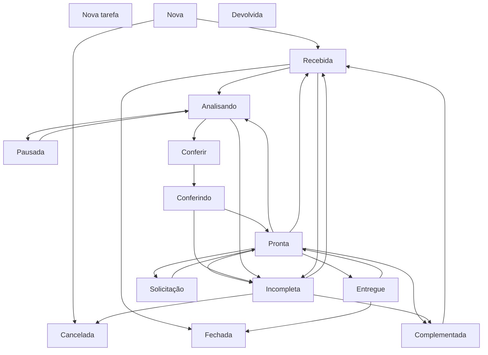

# Fluxo – Papel ADM Qualificação / Tipo de Tarefa: Qualificação

Este diagrama representa exatamente as transições permitidas conforme configurado no Redmine para:

- **Papel:** ADM Qualificação  
- **Tipo de tarefa:** Qualificação

As transições abaixo são baseadas diretamente na matriz de estados marcada no Redmine.

---

## Diagrama Mermaid

